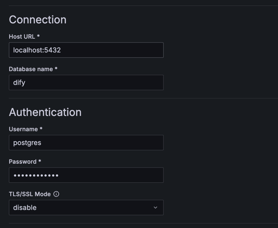

# Dify Grafana Dashboard

A Grafana dashboard for [Dify](https://github.com/langgenius/dify).

- Dashboard JSON file for importing: [dify_grafana_dashboard.json](./dify_grafana_dashboard.json)

## Dashboard Screenshots

- Rows and Panels
    - Overview
    - App Statistics
    - Messages Statistics
    - Tenants Statistics
    - App Trends (TBD)
    - Messages Trends (TBD)

## Dashboard Importing Guidance

1. Add Data sources

- Navigate to `Data sources` tab in `Connections` settings.
  

- Click the `Add new data source` button on the top right corner.
  

- Fill Dify's PostgreSQL connection information and click `Save & Test`.
  

2. Import the Grafana Dashboard

- Navigate to `Dashboards` tab.
  

- Click the `New` button and then the `Import` option.
  

- Upload the `dify_grafana_dashboard.json` file. And select the PostgreSQL data source you created in the previous step.
  Finally, click the `Import` button.
  

- All set! The Dify Grafana dashboard should now be imported and ready for use.

  
